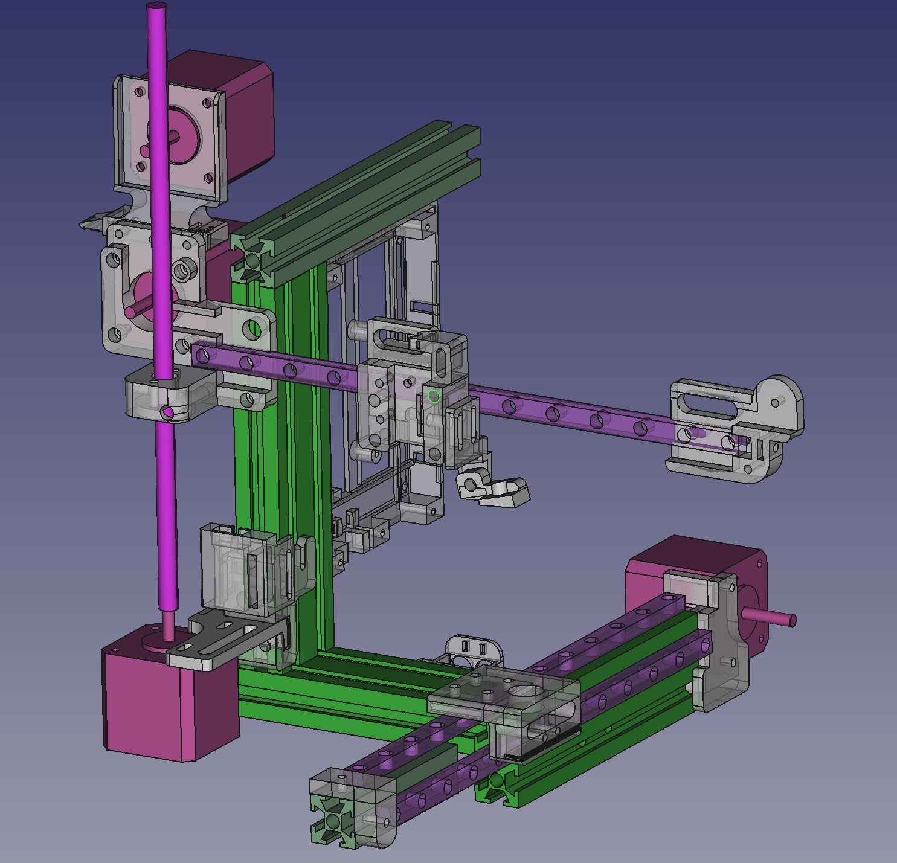
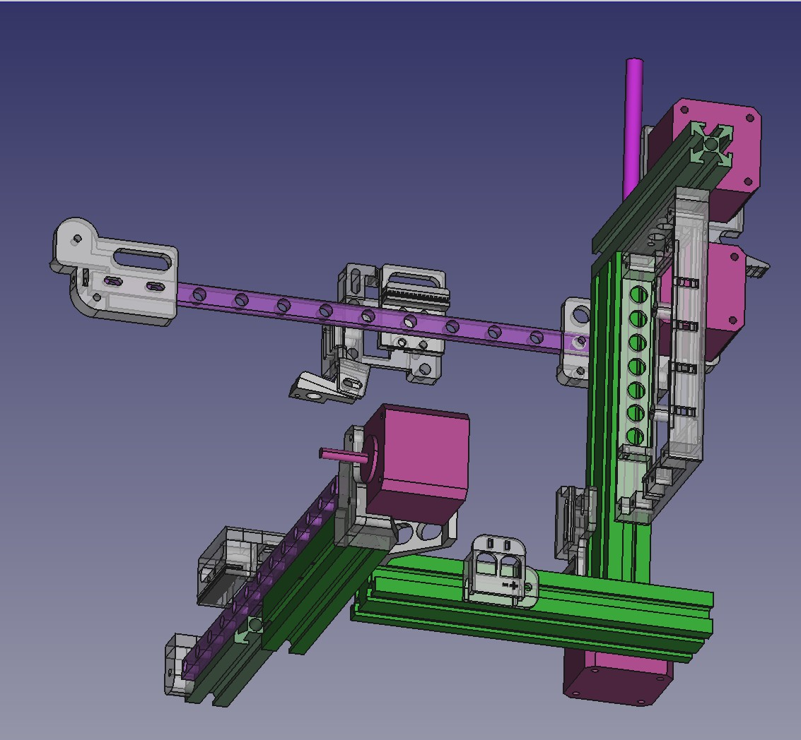
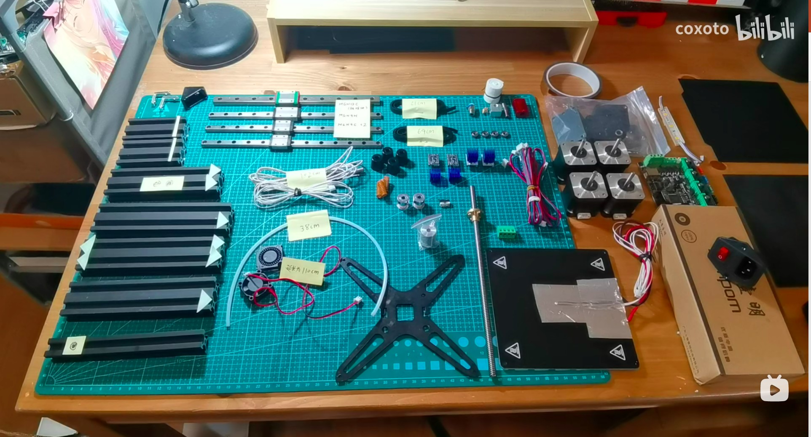
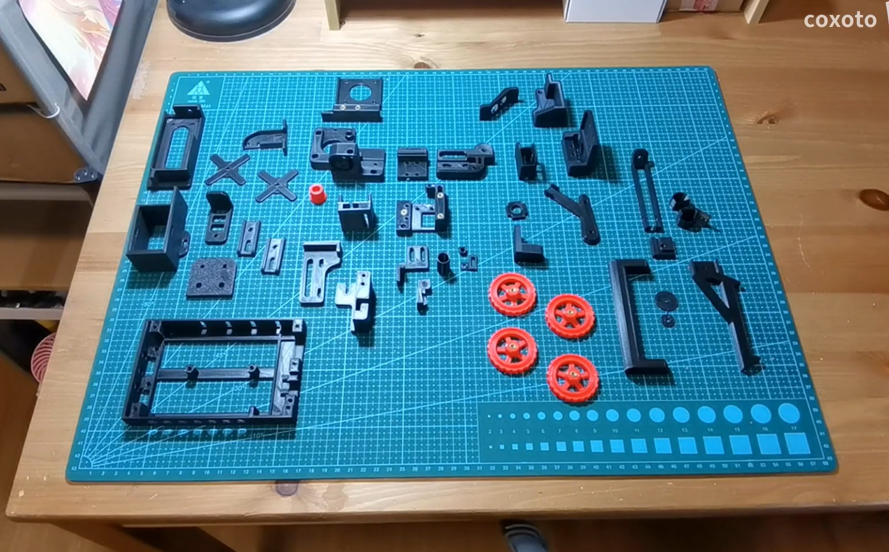
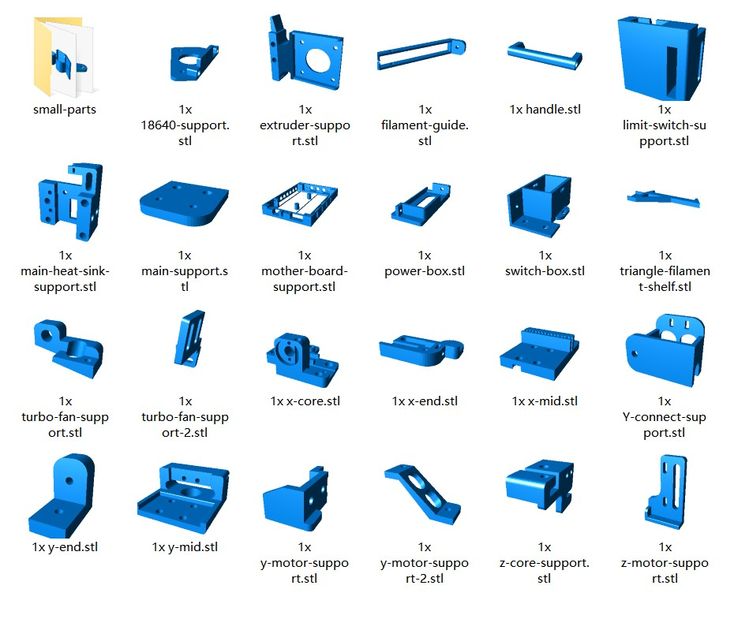

# 代号x 3d打印机

"代号x"是up主花了1年业余时间 改了十多版本 自行设计的3d打印机

姑且说说特点吧：全线轨 Y轴双轨 泰坦挤出 占地空间小 打印空间大（200 * 200 * 200有余） xy无限位回零 全静音驱动（两个2209两个2208）

如何安装请在b站搜索 代号x 3d打印机 有全套安装详解视频 后面有视频列表（如不全说明还在准备中）

## 目录介绍

#### Marlin-2.0 firmware
内有编译好的二进制文件可以直接刷 也有配置文件供大家自行编译（修改的地方有注释）

#### stl
所有部件stl 请自行切片打印

#### design
所有零件采用freecad设计 这边是freecad的源文件 （如有遗漏请去b站留言

#### non-print-parts 
所有非打印件的列表 详情等
也可参考b站视频

B站 系列视频列表：

详解01：非打印件介绍 https://www.bilibili.com/video/BV1SP4y157EU

详解02：打印件 https://www.bilibili.com/video/BV1zM4y1A77G

详解03：螺丝工具等

详解04：xz轴从零安装

详解05：y轴从零安装

详解06：电源模块从零安装

详解07：主板电控从零安装

安装01：骨架篇  https://www.bilibili.com/video/BV16R4y1t7F3

安装02：电控篇  https://www.bilibili.com/video/BV1Qb4y1t71x

安装03：附件篇  https://www.bilibili.com/video/BV1Ng411T722

安装04：联调篇  https://www.bilibili.com/video/BV1RS4y1d71H

其它：调平 https://www.bilibili.com/video/BV1wg411T7SC

其它：实机演示  https://www.bilibili.com/video/BV1sU4y1M7gR

